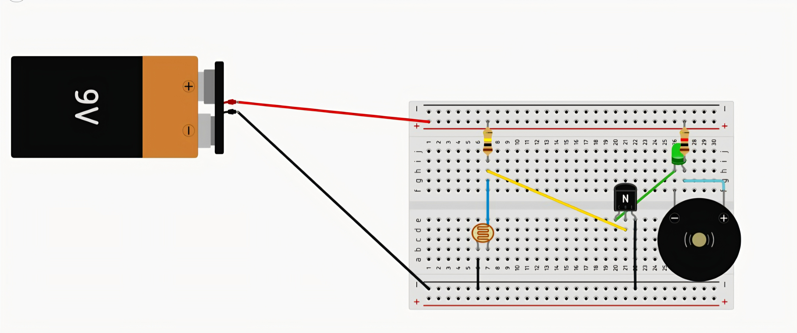
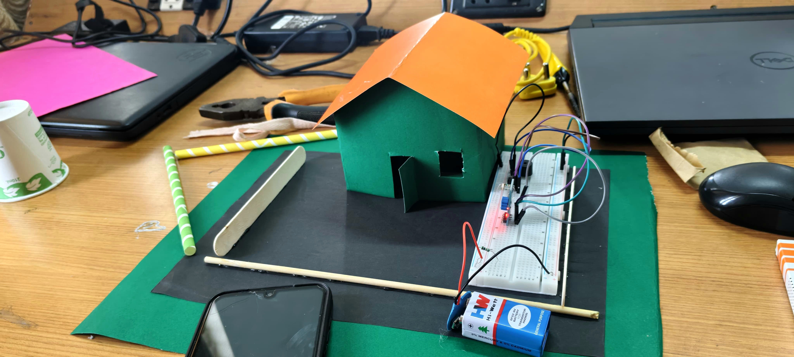

**LDR BASED INTRUDER ALERT SYSTEM**

Aim

To design a simple security system using an LDR sensor to detect an intruder near a house. The system produces an alarm when the light falling on the LDR is interrupted.

Principle

The project works on the principle of change in resistance of an LDR with light intensity. When the light falling on the LDR is blocked, its resistance changes and the transistor activates the buzzer.

Working

o   An LDR sensor is placed outside the house model to detect the surrounding light. Under normal conditions, light falls continuously on the LDR.  
o   When an unwanted person passes in front of the sensor, the light falling on the LDR is blocked.  
o   This changes the resistance of the LDR and the voltage in the control circuit.  
o   The transistor acts as a switch and activates the buzzer.  
o   The buzzer produces an alarm sound to alert the people inside the house.

Components Used

* LDR Sensor  
* Buzzer  
* NPN Transistor  
* Resistor  
* 9V Battery  
* Breadboard  
* Connecting Wires  
*  House Model

Uses / Applications

- [ ] Home security systems.  
- [ ]  Intruder alert systems.  
- [ ] Night-time security.  
- [ ] Door and entrance monitoring.  
- [ ] Small shops and offices and Security demonstration projects.  
      

Project Circuit And Image

